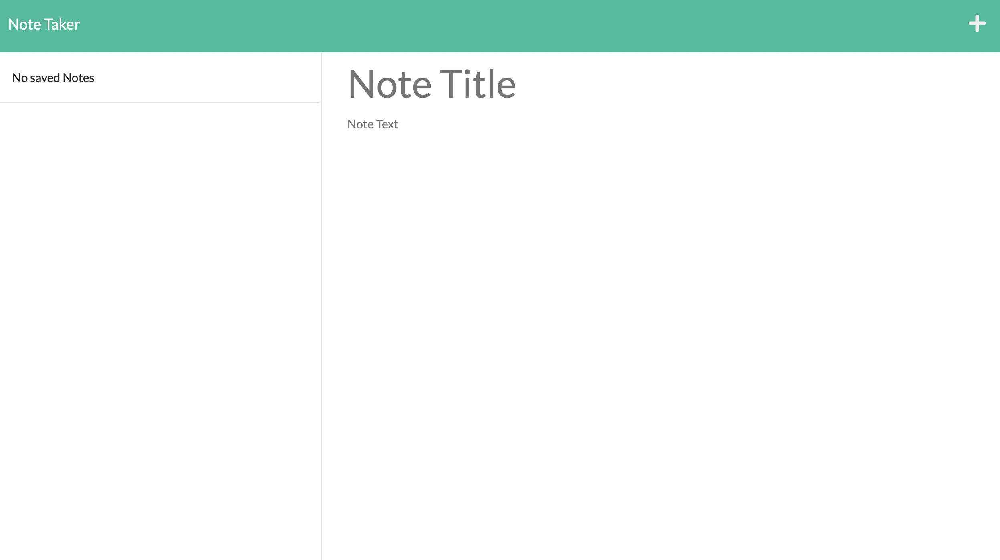

# notetaker-exprssjs

## Description

This application allows the user to take notes with titles and content, save them, and then delete as needed. It uses Express.js on the back end, connecting the front end code with the back end code and allowing input to get retrieved from a JSON file.  The application is deployed on Heroku.


## Acceptance Criteria

```
GIVEN a note-taking application
WHEN I open the Note Taker
THEN I am presented with a landing page with a link to a notes page
WHEN I click on the link to the notes page
THEN I am presented with a page with existing notes listed in the left-hand column, plus empty fields to enter a new note title and the note’s text in the right-hand column
WHEN I enter a new note title and the note’s text
THEN a Save icon appears in the navigation at the top of the page
WHEN I click on the Save icon
THEN the new note I have entered is saved and appears in the left-hand column with the other existing notes
WHEN I click on an existing note in the list in the left-hand column
THEN that note appears in the right-hand column
WHEN I click on the Write icon in the navigation at the top of the page
THEN I am presented with empty fields to enter a new note title and the note’s text in the right-hand column
```

## Mock up


[link to full video](https://drive.google.com/file/d/15Hhs-G-QfHhDSVvIoWLCDkzaApeTGcRV/view)

[link to deployed site](https://dry-plains-17183.herokuapp.com/)

